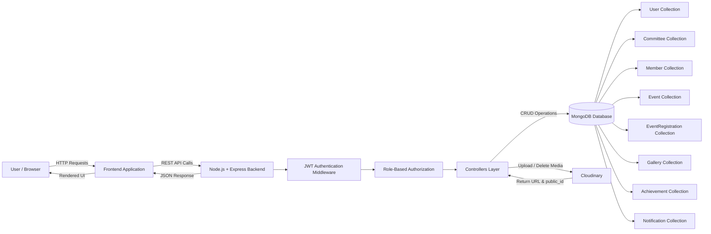

<h1 align="center">
  <a href="https://github.com/CommunityOfCoders/Inheritance2k25">
    CoC Inheritance 2025
  </a>
  <br>
  OneVJTI: One Campus. One System. One Identity.
</h1>

<div align="center">
By Aperture
</div>
<hr>

<details>
<summary>Table of Contents</summary>

- [Description](#description)
- [Links](#links)
- [Tech Stack](#tech-stack)
- [Progress](#progress)
- [Future Scope](#future-scope)
- [Applications](#applications)
- [Project Setup](#project-setup)
- [Team Members](#team-members)
- [Mentors](#mentors)

</details>

## 📝 Description

OneVJTI is a unified campus management platform that connects committees, members, and events under a single secure system. It simplifies organizational workflows while enforcing structured data management and role-based access control.

## 🔗 Links

- [GitHub Repository](https://github.com/meetrathod0729-hub/onevjti-final.git)
- [Demo Video](https://drive.google.com/file/d/1LLRdHNE3sV68wk6FGyLcO1VBmM4bMa5s/view?usp=drive_link)
- [Project Screenshots/Drive](https://drive.google.com/drive/folders/1fJTZ1xPUd6tMUv9_loTPlf8q5WYQpwRl?usp=drive_link)
- [Hosted Website]([Insert Link])

## 🤖 Tech-Stack

### 🏗️ System Architecture



### Front-end
- **React.js**
- **Tailwind CSS**


### Back-end
- **Node.js**
- **ExpressJS**

### Database
- **MongoDB**
- **Cloudinary**

## 📈 Progress

### Fully Implemented Features

* **Authentication & Security**: JWT-based authentication with role-based access control, secure password management, and profile customization.

* **Committee Management**: Admin-controlled committee creation and management with head assignment and public listing.

* **Member Management**: Role-based member operations with ownership validation and cross-committee protection.

* **Event System**: Committee-owned event creation and management with Cloudinary poster uploads and public accessibility.

* **Event Registrations**: User event registration system with duplicate prevention and committee head visibility.

* **Gallery**: Event-linked image gallery with Cloudinary integration and authorized media management.

* **Achievements**: Committee achievement tracking with contest details and public retrieval.

* **Security**: Multi-layer security with JWT validation, role-based middleware, and ownership verification.

* **Media Management**: Cloudinary-powered media storage with automatic cleanup and public_id tracking for lifecycle management.
---

### Partially Implemented Features / Work in Progress

* **Smart Notifications**: Current implementation supports basic notification structure and database schema design.
Advanced features such as real-time delivery, read/unread tracking, and preference controls are partially implemented and under active development.
* **Follow System**: Implemented basic follow and unfollow functionality with authentication checks. Advanced features such as follower analytics and notification integration are currently under development.

## 🔮 Future Scope

* **Analytics & Reporting Dashboard**: Integrate data analytics tools to provide insights on event participation, engagement metrics, and committee performance.
* **Automated Email & Communication Integration**: Add automated email confirmations, reminders, and announcements using email service providers.
* **Mobile Application Expansion**: Extend the platform to Android and iOS using React Native or similar cross-platform technologies to improve accessibility and engagement.

## 💸 Applications

1. **Educational Institutions** - Enables colleges and universities to efficiently manage student committees, technical societies, cultural clubs, and event registrations through a centralized and structured platform.
2. **Corporate Internal Event Management** - Can be adapted for managing internal company events, employee committees, workshops, and training registrations with role-based access control.

## 🛠 Project Setup

Clone the GitHub repo.

```bash
git clone https://github.com/meetrathod0729-hub/onevjti-final.git
cd onevjti-final
```

### Backend Setup (API Server)
1. Open a terminal and navigate to the backend folder:
```bash
 cd onevjti-final/onevjti-backend
```

2. Install dependencies:

```bash
npm install
```

3. Start the development server:

```bash
npm run dev
```

4. The backend API will be available at:

```arduino 
http://localhost:5000/
```
### Frontend Setup
1. Navigate to the frontend folder:
```bash
 cd onevjti-final/onevjti-frontend
```

2. Install dependencies:

```bash
npm install
```

3. Start the development server:

```bash
npm start
```

4. The backend API will be available at:

```arduino 
http://localhost:3000/
```

## 👨‍💻 Team Members

* **Aashay Kamble**: [Github](https://github.com/aashaykk)
* **Omkar Karande**: [Github](https://github.com/omkarrk1010)
* **Shreya Waghmare**: [Github](https://github.com/shrreya19)
* **Meet Rathod**: [Github](https://github.com/meetrathod0729-hub)

## 👨‍🏫 Mentors

* **Yogesh Palve**: [Github](https://github.com/Yogesh-Palve)
* **Ritesh Saindane**: [Github](https://github.com/Ritesh-Saindane)

