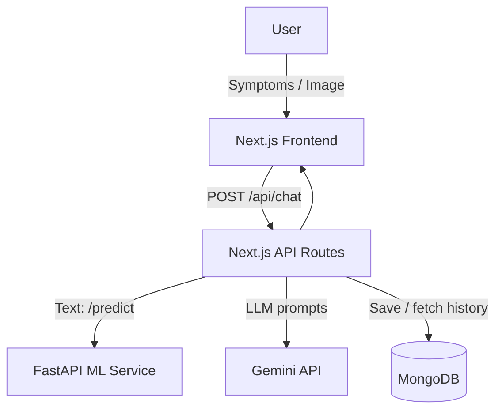

<h1 align="center">
  <a href="https://github.com/CommunityOfCoders/Inheritance2k25">
    CoC Inheritance 2025
  </a>
  <br>
  AI Health Prediction System: Early insights. Smarter care.
</h1>

<div align="center">
By Cache me if u can
</div>

<hr>

<details>
<summary>Table of Contents</summary>

- [Description](#-description)
- [Links](#-links)
- [Tech Stack](#-tech-stack)
- [Progress](#-progress)
- [Future Scope](#-future-scope)
- [Applications](#-applications)
- [Project Setup](#-project-setup)
- [Team Members](#-team-members)
- [Mentors](#-mentors)

</details>

## 📝 Description

AI Health Prediction System is a full-stack assistant that predicts likely diseases from **symptom text** (and optionally **medical images**) and returns a clear, human-friendly explanation with **confidence scores** and **precautions**.

The system combines a traditional **ML classifier (FastAPI)** with **Gemini** for language understanding and safety-focused medical guidance. 

## 🔗 Links

- [GitHub Repository](https://github.com/Ashish982k/Inheritance)
- [Demo Video](#)
- [Project Screenshots/Drive](https://drive.google.com/drive/folders/1E8DEau4SnIhOtIRmb_sabGdwln_R7LH7?usp=sharing)
- [Hosted Website](#)

## 🤖 Tech-Stack

### 🏗️ System Architecture



### Front-end

- Next.js (App Router)
- React
- Tailwind CSS

### Back-end

- Next.js API routes (orchestrator)
- FastAPI + Uvicorn (ML service)

### Database / ML

- MongoDB + Mongoose (optional history persistence)
- Scikit-learn text classifier (TF-IDF + probabilistic prediction)
- Optional image endpoint scaffold (`/predict-image`) with Pillow + multipart
- Gemini (LLM) for multilingual UX + precautions

## 📈 Progress

### Fully Implemented Features

* **Symptom-based predictions**: Top 3 diseases with confidence.
* **Gemini + ML ensemble**: Compares confidence and selects the stronger source.
* **Precautions for exactly Top 3**: No random extra diseases.
* **Modern chat UI**: Clean message view + sticky composer.
* **Multilingual support**: Translate input to English for ML/LLM and translate back.

### Partially Implemented Features / Work in Progress

* **Image prediction**: Endpoint exists; requires trained artifacts for best results.
* **Medical history persistence**: Works when MongoDB is configured; gracefully degrades if DB is unavailable.

## 🔮 Future Scope

* **Better calibration**: Improve confidence calibration + combine ML and Gemini with weighted voting.
* **Doctor-ready exports**: One-click PDF report with symptom timeline and predicted conditions.
* **Stronger guardrails**: Safety checks for emergency symptoms + escalation suggestions.
* **Mobile-first UX**: Dedicated responsive layout + offline-friendly caching.

## 💸 Applications

1. **Early symptom triage** - quick, structured guidance before visiting a doctor.
2. **Patient education** - easy-to-understand precautions and safety instructions.
3. **Telemedicine support** - share top predictions + confidence + history summary.

## 🛠 Project Setup

> You need to run **both** the ML backend and the Next.js app.

### 1) Run ML (FastAPI)

Windows (PowerShell):

```bash
cd ML
python -m venv .venv
.\.venv\Scripts\python -m pip install --upgrade pip
.\.venv\Scripts\pip install -r requirements.pinned.txt
.\.venv\Scripts\python -m uvicorn main:app --reload --host 127.0.0.1 --port 8000
```

ML runs at:

- `http://127.0.0.1:8000`

### 2) Run Frontend (Next.js)

```bash
cd my-app
npm install
npm run dev
```

Frontend runs at:

- `http://localhost:3000`

### 3) Environment Variables (Next.js)

Create `my-app/.env`:

```env
GEMINI_API_KEY=YOUR_KEY
GEMINI_MODEL=gemini-1.5-flash

# Optional (for history)
MONGODB_URI=YOUR_MONGODB_URI
```

## 👨‍💻 Team Members

* **Aasish Gupta (Leader)**: https://github.com/Ashish982k
* **Vedant Tamhanekar (Vice Leader)**: https://github.com/vedenthu17
* **Siddhant Salunke**: https://github.com/sidcodes2727
* **Tanish Parekh**: https://github.com/TanishParekh03

## 👨‍🏫 Mentors

* **Zoher Vohra**
* **Abhay Upadhyay**

