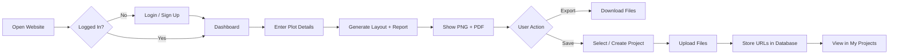

<h1 align="center">
  <a href="https://github.com/CommunityOfCoders/Inheritance2k25">
    CoC Inheritance 2025
  </a>
  <br>
  ArchiTech: “Vastu Principles, Powered by Constraints.”
</h1>

<div align="center">
By Code4Cure
</div>
<hr>

<details>
<summary>Table of Contents</summary>

- [Description](#description)
- [Links](#links)
- [Tech Stack](#tech-stack)
- [Progress](#progress)
- [Future Scope](#future-scope)
- [Applications](#applications)
- [Project Setup](#project-setup)
- [Team Members](#team-members)
- [Mentors](#mentors)

</details>

## 📝 Description

ArchiTech is an floor-plan generation application that creates Vastu-compliant layouts using minimal inputs such as plot size and house type (1BHK, 2BHK, or 3BHK). It uses Operations Research and constraint-based logic to optimize space and bridge the gap between user needs and practical architectural design.

## 🔗 Links

- https://github.com/Shreysk21/architech
- https://drive.google.com/drive/folders/1NplzB9zzQvVJa87qtkux9nfSFmBV2SxG?usp=drive_link
- https://drive.google.com/drive/folders/1u_lMBVGUlAkpWiBT0u9HZsZfImFjOqoD?usp=drive_link

## 🤖 Tech-Stack

### 🏗️ System Architecture



### Front-end: Typescript,Tailwind CSS
### Back-end: Python REST API 
### OR-Tools
### Database: Firebase(User-credentials),Uploadstore(Image and report storage)

## 📈 Progress

### Fully Implemented Features

* **Automatic Vastu-Compliant Floor Plan Generation**:
  1. Generates 1BHK, 2BHK, and 3BHK floor plans
  2. Uses Vastu Shastra rules (direction, zoning, room placement)
  3. Produces standard 2D top-view plans with:
       3.1. Connected rooms
       3.2. Recognizable furniture symbols
       3.3. Doors, windows, parking, puja room
       3.4. North arrow & dimension annotations
  4. Output generated as SVG / image.
   
* **Room based Furniture placement**:
  1. Furniture placed relative to room geometry, not random
  2. Room-specific rule sets:
       2.1. Living Room (sofa, TV, table, etc.)
       2.2. Bedroom (bed, study table(optional))
       2.3. Kitchen (platform, sink, stove, dining table)
       2.4. Toilet/Bathroom (sink,WC)
  3. Fully rule-based and extensible.

* **User accounts with saved designs and report generation.** :
    1.Layout generation and saving layout history in user project section.
    2.Overall analysis report is generated and saved in project section as per user choice.
    3.Exporting floor plan for usage.
    
 

   


### Partially Implemented Features / Work in Progress

* **South/East orientation entrance layout**:Currently, the layouts are generated with north- or east-facing entrances, which are considered auspicious directions. We are now working on supporting south- and west-facing entrances as well, since users may have plots with these orientations. The goal is to ensure that even these layouts remain fully Vastu-compliant despite the directional constraints.

## 🔮 Future Scope

* Enhanced vastu scoring with priority-based rule weighting.
* Support for duplex, villas, and commercial layouts.
* 3D visualization generated floor plans.


## 💸 Applications

1. **Residential House Planning** - It enables homeowners to obtain accurate, Vastu-compliant designs without requiring deep architectural or traditional Vastu expertise.
2. **Educational & Academic Use** - It helps architecture, civil, and computer science students understand the real-world application of constraint satisfaction, Operations Research, and rule-based systems through an interactive, problem-solving approach.

## 🛠 Project Setup

1. Clone the GitHub repo.

```bash
https://github.com/Shreysk21/architech

```

2. Enter the project directory and install dependencies.

```bash
cd architech
cd code
cd Backend
pip install ortools fastapi uvicorn python-multipart
cd Frontend
npm install

```

3. Start the application.
Run Frontend

```bash
npm start
npm run dev

```
Run Backend
```bash
python -m uvicorn main:app --reload

```

## 👨‍💻 Team Members

* **Aishwarya Jadhav**: AishVerse
* **Rudrani Wadelkar**: rudrani29
* **Shreya Kale**: Shreysk21
* **Sejal Bodakhe**: sejal-176

## 👨‍🏫 Mentors

* **Ishaan Shaikh**: Ishaan0132
* **Vedant Anasune**: VEDLESS
