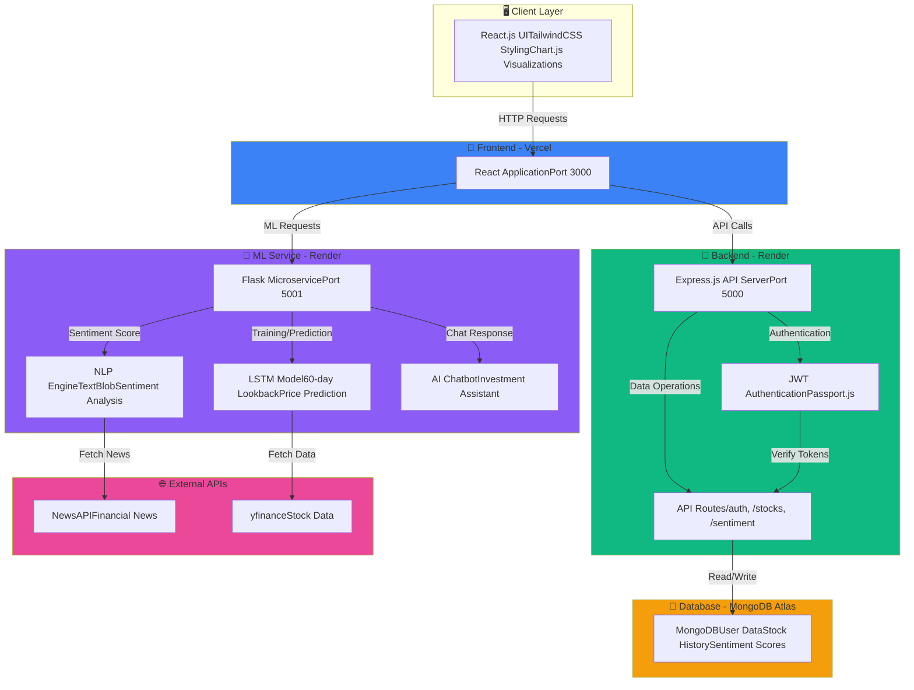

<h1 align="center">
  <a href="https://github.com/CommunityOfCoders/Inheritance2k25">
    CoC Inheritance 2025
  </a>
  <br>
  FinIQ - Smart Investment Platform :  
</h1>

<div align="center">
By QuantiFi Team
</div>
<hr>

<details>
<summary>Table of Contents</summary>

- [Description](#description)
- [Links](#links)
- [Tech Stack](#tech-stack)
- [Key Features](#key-features)
- [System Architecture](#system-architecture)
- [Progress](#progress)
- [Future Scope](#future-scope)
- [Applications](#applications)
- [Project Setup](#project-setup)
- [Team Members](#team-members)
- [Mentors](#mentors)

</details>
<a name="description"></a>

## Description

**FinIQ** revolutionizes stock market analysis by combining **cutting-edge machine learning with intuitive design**. Built on the **MERN stack** with an integrated **Flask ML service**, it delivers sophisticated **LSTM-based price forecasting, real-time news sentiment analysis, and conversational AI assistance**—all in one seamless platform.

Whether you're a seasoned trader or just starting your investment journey, FinIQ transforms complex market data into **actionable insights**.

<a name="links"></a>

## 🔗 Links

- [GitHub Repository](https://github.com/swamini-jadhav/FinIQ)
- [Demo Video](https://drive.google.com/drive/folders/1pE3CsY2YKWbhTr1CKZrCfcwylNtai7Sd)
- [Screenshots Folder](https://drive.google.com/drive/folders/1pE3CsY2YKWbhTr1CKZrCfcwylNtai7Sd)
- [Hosted Website](https://fin-iq-neon.vercel.app/)

<a name="tech-stack"></a>

## 🤖 Tech-Stack

### Frontend
* **React.js** - Component-based UI
* **TailwindCSS** - Modern styling
* **Chart.js** - Data visualization
* **React Router** - Navigation
* **Axios** - HTTP client

### Backend
* **Node.js** - Runtime environment
* **Express.js** - Web framework
* **MongoDB** - NoSQL database
* **Mongoose** - ODM
* **JWT** - Authentication
* **Passport.js** - Auth middleware

### ML Service
* **Flask** - Microservice framework
* **PyTorch** - Deep learning
* **LSTM Networks** - Time series forecasting
* **yfinance** - Market data
* **TextBlob** - NLP for sentiment analysis
* **NewsAPI** - News feeds

### Hosting & Deployment
* **Vercel** - Frontend deployment
* **Render** - Backend & ML service deployment
* **MongoDB Atlas** - Cloud database

### 🏗️ System Architecture


### Front-end
* [React.js](https://react.dev/) --> Component-based UI with modern hooks and state management for seamless user experience
* [TailwindCSS](https://tailwindcss.com/) --> Utility-first CSS framework for responsive, beautiful styling across all devices
* [Chart.js](https://www.chartjs.org/) --> Dynamic data visualization for stock price trends, predictions, and sentiment charts

### Back-end
* [Node.js](https://nodejs.org/) & [Express.js](https://expressjs.com/) --> Lightweight, fast REST API server for handling client requests
* JWT Authentication --> Secure token-based authentication with Passport.js middleware for protected routes
* [Render](https://render.com/) --> Backend deployment and API hosting with automatic scaling

### ML Service
* [Flask](https://flask.palletsprojects.com/) --> Lightweight Python microservice framework for AI/ML model serving on port 5001
* [PyTorch](https://pytorch.org/) --> Deep learning framework for building and training neural networks
* **LSTM Networks** --> Multi-layer Long Short-Term Memory architecture with 60-day temporal lookback window for accurate price forecasting
* **yfinance** --> Real-time stock market data fetching and historical price data collection
* **TextBlob** --> Natural Language Processing for sentiment classification (Positive/Neutral/Negative)
* **NewsAPI** --> Live financial news aggregation from premium sources for sentiment analysis

### Database
* [MongoDB](https://www.mongodb.com/) --> NoSQL document database for flexible user data, stock history, and sentiment scores
* [MongoDB Atlas](https://www.mongodb.com/cloud/atlas) --> Cloud-hosted MongoDB with automatic backups and scaling

<a name="progress"></a>

## 📈 Progress

### Fully Implemented Features

* **JWT-based Authentication System**: Secure user authentication with Passport.js and encrypted passwords
* **Real-time Stock Data Integration**: Live market data fetching using yfinance API
* **LSTM Price Prediction Model**: Deep learning model with 60-day lookback window trained on historical data
* **Sentiment Analysis Engine**: NLP-based sentiment classification using TextBlob with news API integration
* **Interactive Dashboard**: Chart.js visualizations for price trends, predictions, and sentiment data
* **AI Chatbot**: Context-aware investment assistant for stock market queries
* **Responsive UI**: Fully styled with TailwindCSS for all devices

### Partially Implemented Features / Work in Progress

* **Advanced Technical Indicators**: RSI, MACD, and Bollinger Bands calculations
* **Portfolio Tracking**: Multi-stock portfolio management features
* **Email/SMS Alerts**: Price alert notification system
* **Mobile App**: React Native mobile application

<a name="future-scope"></a>

## 🔮 Future Scope

* **Multi-stock Portfolio Tracking**: Complete portfolio management system
* **Advanced Technical Indicators**: RSI, MACD, Bollinger Bands implementation
* **Email/SMS Price Alerts**: Notification system for price changes
* **Social Sentiment Integration**: Twitter, Reddit sentiment analysis
* **Mobile Application**: React Native iOS and Android apps
* **Enhanced ML Models**: Improved LSTM accuracy and ensemble methods
* **Real-time Collaboration**: Social features for sharing strategies
* **Backtesting Engine**: Test strategies against historical data

<a name="applications"></a>

## 💸 Applications

1. **Stock Market Analysis Platform** - Real-time analysis combining LSTM predictions with sentiment analysis for informed trading decisions
2. **AI-Powered Investment Advisory** - Automated chatbot providing 24/7 market insights and investment guidance
3. **Sentiment-Driven Trading** - Use news sentiment as a factor in trading strategies
4. **Retail Investor Tool** - Democratizing advanced market analysis for individual traders
5. **Financial Education** - Help beginners understand stock market dynamics through visual analytics

<a name="project-setup"></a>

## 🛠 Project Setup

### Prerequisites
* Node.js (v18.x or higher)
* Python (v3.9 or higher)
* MongoDB (v6.x or higher)
* npm or yarn
* pip (Python package manager)

### 1️⃣ Clone the Repository
```bash
git clone https://github.com/QuantiFi/FinIQ.git
cd FinIQ
```

### 2️⃣ Backend Setup
```bash
cd backend

# Install dependencies
npm install

# Create .env file
cat > .env << EOF
PORT=5000
MONGODB_URI=mongodb://localhost:27017/finiq
JWT_SECRET=your_jwt_secret_key_here
NODE_ENV=development
EOF

# Start the server
npm start
```
Backend runs on **http://localhost:5000**

### 3️⃣ ML Service Setup
```bash
cd ../ml-service

# Create virtual environment
python -m venv venv

# Activate virtual environment
# On Windows (Command Prompt):
venv\Scripts\activate
# On Windows (PowerShell):
venv\Scripts\Activate.ps1
# On macOS/Linux:
source venv/bin/activate

# Install dependencies
pip install -r requirements.txt

# Create .env file
cat > .env << EOF
FLASK_PORT=5001
NEWS_API_KEY=your_newsapi_key_here
FLASK_ENV=development
EOF

# Start Flask service
python app.py
```
ML Service runs on **http://localhost:5001**

### 4️⃣ Frontend Setup
```bash
cd ../frontend

# Install dependencies
npm install

# Create .env file
cat > .env << EOF
REACT_APP_API_URL=http://localhost:5000
REACT_APP_ML_API_URL=http://localhost:5001
EOF

# Start development server
npm start
```
Frontend runs on **http://localhost:3000**

### 🔑 API Keys Required
* **NewsAPI**: Get your free key at [newsapi.org](https://newsapi.org)
* **MongoDB**: Set up local instance or use MongoDB Atlas

<a name="team-members"></a>

## 👨‍💻 Team Members

* **Sahil Apage**: [GitHub](https://github.com/sahilapage)
* **Swamini Jadhav**: [GitHub](https://github.com/swamini-jadhav)
* **Muskaan Karwa**: [GitHub](https://github.com/muskaankarwa) 
* **Aaradhana Chaudhary**: [GitHub](https://github.com/aaradhanac07)

<a name="mentors"></a>

## 👨‍🏫 Mentors

* **Rushabh Mehta**: [LinkedIn](https://github.com/RushabhMehta2005)
* **Siddhesh Pandey**: [GitHub](https://github.com/sid-7905)