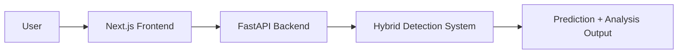

<h1 align="center">
  <a href="https://github.com/CommunityOfCoders/Inheritance2k25">
    CoC Inheritance 2025
  </a>
  <br>
  AI Text Detector : Detect • Analyze • Improve
</h1>

<div align="center">
By <b>Vision Coders</b>
</div>
<hr>

<details>
<summary>Table of Contents</summary>

- [Description](#description)
- [Links](#links)
- [Tech Stack](#tech-stack)
- [Progress](#progress)
- [Future Scope](#future-scope)
- [Applications](#applications)
- [Project Setup](#project-setup)
- [Team Members](#team-members)
- [Mentors](#mentors)

</details>

---

## 📝 Description

**AI Text Detector** is a full-stack web application that detects whether a given text is AI-generated or human-written. Along with detection, it also provides grammar checking, plagiarism checking, and detailed text analysis feedback.

The project uses **Next.js** for the frontend and **FastAPI** for the backend, integrating a trained ML model to analyze textual patterns and classify content intelligently using a hybrid (ML + rule-based) approach.

---

## 🔗 Links

- **GitHub Repository**  
  https://github.com/Inheritance-2K25/ai-text-detector

- **Demo Video**  
  https://drive.google.com/file/d/1YpC4btnFt-OfIdVkLildigZQ-shzwmdx/view?usp=sharing

- **Project Screenshots**  
  https://drive.google.com/drive/folders/1umSj9-Wi9Mh0YJkFyJSmXZlfTyPyj1qU?usp=sharing

- **Model Download**  
  https://drive.google.com/drive/folders/1OIKNyhRfeotAHg17Y96lGIgxGiiccZ7c?usp=sharing

- **Hosted Website**  
  _To be added_

---

## 🤖 Tech Stack

### 🏗️ System Architecture



---

### 💻 Frontend

- Next.js
- React.js
- Tailwind CSS
- JavaScript

**Features:**

- Text input interface
- AI detection result display
- Grammar checker UI
- Plagiarism checker UI
- Extension integration support

---

### ⚙️ Backend

- FastAPI
- Python
- Hybrid ML + Rule-Based Detection

**Backend Structure:**

- `app.py` – Main API entry point
- `inference.py` – Model inference logic
- `grammar.py` – Grammar analysis
- `chunking.py` – Text chunking logic
- `rules.py` – Rule-based detection
- `schemas.py` – Request/Response validation
- `style.py` – Style analysis module
- `model/` – ML model storage
- `hybrid/` – Hybrid detection system

---

### 🧠 Machine Learning Model

- Trained AI vs Human classification model
- Hybrid approach (ML + rule-based analysis)
- Model downloadable separately (Drive link provided above)

---

## 📈 Progress

### ✅ Fully Implemented Features

- **AI Text Detection** – Classifies text as AI-generated or Human-written
- **Grammar Checker** – Detects grammatical issues and suggests improvements
- **Plagiarism Checker** – Checks similarity patterns
- **Text Analysis Feedback** – Provides structured analysis of input text
- **Browser Extension** – Chrome extension for quick detection

---

### 🚧 Work in Progress

- Model fine-tuning for improved accuracy
- Performance optimization for long text inputs
- UI responsiveness improvements
- Scalable deployment setup

---

## 🔮 Future Scope

- User authentication & saved history
- Advanced analytics dashboard
- Cloud deployment with scalability
- Multi-language detection support
- Public API access for third-party integration

---

## 💸 Applications

1. **Educational Institutions** – Detect AI-generated assignments and essays
2. **Content Publishing Platforms** – Verify originality of articles
3. **Recruitment Platforms** – Validate authenticity of written responses
4. **Freelancing Platforms** – Ensure human-generated submissions

---

## 🛠 Project Setup

### 1️⃣ Clone the Repository

```bash
git clone https://github.com/Inheritance-2K25/ai-text-detector.git
cd ai-text-detector
```

---

### 2️⃣ Frontend Setup (Next.js)

Install dependencies:

```bash
npm install
```

Run frontend:

```bash
npm run dev
```

Frontend runs on:

```
http://localhost:3000
```

---

### 3️⃣ Backend Setup (FastAPI)

Go to backend directory:

```bash
cd backend
pip install -r requirements.txt
```

Run the server:

```bash
uvicorn app:app --reload
```

Backend runs on:

```
http://127.0.0.1:8000
```

---

### 4️⃣ Model Setup

Download the model from the Drive link provided above and place it inside:

```
backend/model/
```

---

## 👨‍💻 Team Members

- **Vivek Kamant** – 241070033
- **Yash Deshmukh** – 241070018
- **Shreyansh Mojidra** – 241070045
- **Paarth Maharshi** – 241070050

**Team Name:** Vision Coders

---

## 👨‍🏫 Mentors

- **Divya Addagatla** – https://github.com/adivya15
- **Pragati Kharat** – https://github.com/pragatikharat17

---
